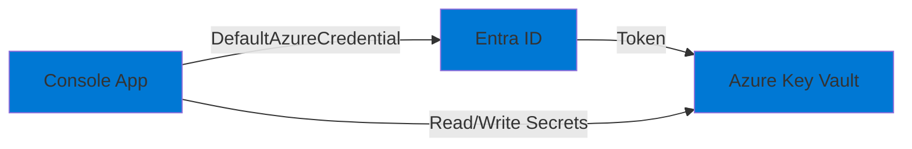

# 00-Auth-KeyVault

## Purpose

This project demonstrates Azure authentication using **Entra ID (Azure AD)** and accessing secrets from **Azure Key Vault**. It showcases:

- Using `DefaultAzureCredential` for authentication (supports Azure CLI, Visual Studio, Managed Identity, etc.)
- Reading and writing secrets to Azure Key Vault
- Role-based access control (RBAC) for Key Vault
- Production-ready patterns: dependency injection, options pattern, structured logging

## Architecture



## Prerequisites

- .NET 9 SDK
- Azure CLI installed and configured (`az login`)
- Azure subscription with permissions to create resources
- PowerShell 7+ (for deployment script) or Bash

## Setup

### 1. Deploy Infrastructure

Deploy the Key Vault and configure RBAC:

```powershell
# PowerShell
cd infra
.\deploy.ps1 -ProjectName "00-Auth-KeyVault" -Environment "dev"
```

```bash
# Bash
cd infra
./deploy.sh 00-Auth-KeyVault dev
```

This will:
- Create a resource group `rg-ailab-dev`
- Create a Key Vault `kv-ailab-<random>`
- Assign the "Key Vault Secrets User" role to your user account
- Output the Key Vault URI

### 2. Configure Application

Set the Key Vault URI:

**Option A: appsettings.json**
```json
{
  "KeyVault": {
    "VaultUri": "https://kv-ailab-xxxxx.vault.azure.net/"
  }
}
```

**Option B: Environment Variable**
```powershell
$env:KEYVAULT__VAULTURI = "https://kv-ailab-xxxxx.vault.azure.net/"
```

**Option C: User Secrets (for local dev)**
```bash
dotnet user-secrets set "KeyVault:VaultUri" "https://kv-ailab-xxxxx.vault.azure.net/"
```

### 3. Authenticate Locally

Ensure you're logged in to Azure CLI:

```bash
az login
az account show  # Verify current subscription
```

## Run

### Local Development

```bash
cd src/00-Auth-KeyVault
dotnet run
```

The application will:
1. Authenticate using your Azure CLI credentials
2. Set a test secret in Key Vault
3. Retrieve the secret
4. List all secrets in the vault

### Deployed (Managed Identity)

When deployed to Azure (e.g., Container Apps, App Service), the application automatically uses the managed identity of the hosting service. No code changes needed!

## Smoke Test

```bash
# Run the application
dotnet run

# Expected output:
# - Successfully sets a test secret
# - Retrieves the secret value
# - Lists all secrets
# - No authentication errors
```

## Teardown

Remove all resources:

```powershell
# PowerShell
cd infra
.\deploy.ps1 -ProjectName "00-Auth-KeyVault" -Environment "dev" -Action "destroy"
```

```bash
# Bash
cd infra
./deploy.sh 00-Auth-KeyVault dev destroy
```

Or manually:

```bash
az group delete --name rg-ailab-dev --yes --no-wait
```

## Troubleshooting

### Authentication Errors

**Error: "DefaultAzureCredential failed to retrieve a token"**

- Ensure you're logged in: `az login`
- Verify subscription: `az account show`
- Check that your account has the "Key Vault Secrets User" role on the Key Vault

**Error: "Access denied" or "Forbidden"**

- Verify RBAC role assignment:
  ```bash
  az role assignment list --scope /subscriptions/{sub-id}/resourceGroups/rg-ailab-dev/providers/Microsoft.KeyVault/vaults/kv-ailab-xxxxx
  ```
- Assign the role manually if needed:
  ```bash
  az role assignment create \
    --role "Key Vault Secrets User" \
    --assignee $(az account show --query user.name -o tsv) \
    --scope /subscriptions/{sub-id}/resourceGroups/rg-ailab-dev/providers/Microsoft.KeyVault/vaults/kv-ailab-xxxxx
  ```

### Configuration Errors

**Error: "KeyVault:VaultUri must be configured"**

- Ensure the VaultUri is set in appsettings.json or environment variable
- Check the format: must be a valid URI ending with `/`

### Network/Firewall Issues

- If Key Vault has firewall enabled, add your IP or allow Azure services
- For local dev, consider disabling the firewall or using "Allow trusted Microsoft services"

## Cost Considerations

- Key Vault: **Free tier** available (up to 10,000 transactions/month)
- No compute costs (runs locally)
- Total cost: **$0** for typical development/testing

## Next Steps

- Try deploying this to Azure Container Apps (see project 08)
- Integrate with other services that need secrets
- Explore Key Vault certificates and keys (not just secrets)
