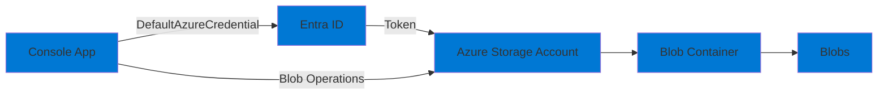

# 01-Storage-Blob

## Purpose

This project demonstrates working with **Azure Blob Storage** using the Azure SDK and managed identity authentication. It showcases:

- Creating containers
- Uploading and downloading blobs
- Setting blob metadata
- Listing blobs
- Generating SAS (Shared Access Signature) URLs
- Using RBAC for storage access (no connection strings needed)

## Architecture



## Prerequisites

- .NET 9 SDK
- Azure CLI installed and configured (`az login`)
- Azure subscription with permissions to create resources
- PowerShell 7+ or Bash

## Setup

### 1. Deploy Infrastructure

Deploy the Storage Account and configure RBAC:

```powershell
# PowerShell
cd infra
.\deploy.ps1 -ProjectName "01-Storage-Blob" -Environment "dev"
```

```bash
# Bash
cd infra
./deploy.sh 01-Storage-Blob dev
```

This will:
- Create a resource group `rg-ailab-dev`
- Create a Storage Account `stailab<random>` (Standard LRS, Hot tier)
- Create a blob container `demo-container`
- Assign the "Storage Blob Data Contributor" role to your user account
- Output the storage account name

### 2. Configure Application

Set the Storage Account name:

**Option A: appsettings.json**
```json
{
  "Storage": {
    "AccountName": "stailabxxxxx",
    "ContainerName": "demo-container"
  }
}
```

**Option B: Environment Variable**
```powershell
$env:STORAGE__ACCOUNTNAME = "stailabxxxxx"
$env:STORAGE__CONTAINERNAME = "demo-container"
```

**Option C: User Secrets**
```bash
dotnet user-secrets set "Storage:AccountName" "stailabxxxxx"
dotnet user-secrets set "Storage:ContainerName" "demo-container"
```

### 3. Authenticate Locally

Ensure you're logged in to Azure CLI:

```bash
az login
az account show
```

## Run

### Local Development

```bash
cd src/01-Storage-Blob
dotnet run
```

The application will:
1. Authenticate using your Azure CLI credentials
2. Ensure the container exists (create if needed)
3. Upload a test blob with metadata
4. Download the blob
5. List all blobs in the container
6. Generate a SAS URL (if permissions allow)

## Smoke Test

```bash
# Run the application
dotnet run

# Expected output:
# - Container created/verified
# - Blob uploaded successfully
# - Blob downloaded and content displayed
# - List of all blobs
# - SAS URL generated (or warning if permissions insufficient)
```

## Teardown

Remove all resources:

```powershell
# PowerShell
cd infra
.\deploy.ps1 -ProjectName "01-Storage-Blob" -Environment "dev" -Action "destroy"
```

```bash
# Bash
cd infra
./deploy.sh 01-Storage-Blob dev destroy
```

Or manually:

```bash
az group delete --name rg-ailab-dev --yes --no-wait
```

## Troubleshooting

### Authentication Errors

**Error: "This request is not authorized to perform this operation"**

- Verify RBAC role assignment:
  ```bash
  az role assignment list \
    --scope /subscriptions/{sub-id}/resourceGroups/rg-ailab-dev/providers/Microsoft.Storage/storageAccounts/stailabxxxxx
  ```
- Assign the role manually if needed:
  ```bash
  az role assignment create \
    --role "Storage Blob Data Contributor" \
    --assignee $(az account show --query user.name -o tsv) \
    --scope /subscriptions/{sub-id}/resourceGroups/rg-ailab-dev/providers/Microsoft.Storage/storageAccounts/stailabxxxxx
  ```

### Container Not Found

- The application will create the container if it doesn't exist
- Ensure the Storage Account name is correct
- Check that the "Storage Blob Data Contributor" role is assigned

### SAS URL Generation Fails

- Generating SAS URLs requires either:
  - Storage Account Key Operator role (for account key-based SAS)
  - Or use User Delegation Keys (requires additional setup)
- This is expected in many scenarios; the demo will log a warning and continue

### Network/Firewall Issues

- If Storage Account has firewall enabled, add your IP or allow Azure services
- For local dev, consider disabling the firewall or using "Allow trusted Microsoft services"

## Cost Considerations

- Storage Account: **Standard LRS, Hot tier**
  - Storage: ~$0.018/GB/month
  - Transactions: First 10,000/month free, then ~$0.004 per 10,000
- For typical development/testing: **< $1/month** (minimal data)

## Next Steps

- Try uploading different file types (images, JSON, etc.)
- Explore blob snapshots and versioning
- Implement blob lifecycle management policies
- Integrate with Event Grid for blob change notifications (see project 05)
