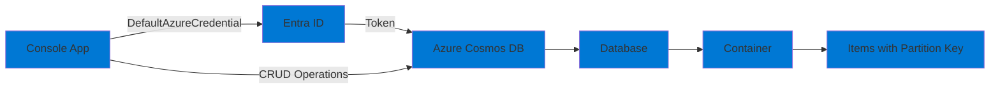

# 02-Db-Cosmos

## Purpose

This project demonstrates working with **Azure Cosmos DB** using the Azure SDK and managed identity authentication. It showcases:

- Creating databases and containers
- CRUD operations (Create, Read, Update, Delete)
- Querying with partition keys
- Understanding Request Units (RU) consumption
- Using RBAC for Cosmos DB access

## Architecture



## Prerequisites

- .NET 9 SDK
- Azure CLI installed and configured (`az login`)
- Azure subscription with permissions to create resources
- PowerShell 7+ or Bash

## Setup

### 1. Deploy Infrastructure

Deploy the Cosmos DB account:

```powershell
# PowerShell
cd infra
.\deploy.ps1 -ProjectName "02-Db-Cosmos" -Environment "dev"
```

```bash
# Bash
cd infra
./deploy.sh 02-Db-Cosmos dev
```

This will:
- Create a resource group `rg-ailab-dev`
- Create a Cosmos DB account (Core SQL API, Serverless mode for cost savings)
- Assign the "Cosmos DB Built-in Data Contributor" role to your user account
- Output the account endpoint

**Note:** Cosmos DB serverless mode is used to minimize costs. It charges per request rather than reserved throughput.

### 2. Configure Application

Set the Cosmos DB account endpoint:

**Option A: appsettings.json**
```json
{
  "CosmosDb": {
    "AccountEndpoint": "https://cosmos-ailab-xxxxx.documents.azure.com:443/",
    "DatabaseName": "demo-db",
    "ContainerName": "items"
  }
}
```

**Option B: Environment Variable**
```powershell
$env:COSMOSDB__ACCOUNTENDPOINT = "https://cosmos-ailab-xxxxx.documents.azure.com:443/"
$env:COSMOSDB__DATABASENAME = "demo-db"
$env:COSMOSDB__CONTAINERNAME = "items"
```

**Option C: User Secrets**
```bash
dotnet user-secrets set "CosmosDb:AccountEndpoint" "https://cosmos-ailab-xxxxx.documents.azure.com:443/"
```

### 3. Authenticate Locally

Ensure you're logged in to Azure CLI:

```bash
az login
az account show
```

## Run

### Local Development

```bash
cd src/02-Db-Cosmos
dotnet run
```

The application will:
1. Authenticate using your Azure CLI credentials
2. Create the database and container if they don't exist
3. Create sample items
4. Read, update, and query items
5. Delete an item
6. Display RU (Request Unit) consumption for each operation

## Smoke Test

```bash
# Run the application
dotnet run

# Expected output:
# - Database and container created/verified
# - Items created successfully
# - Items read, updated, queried, and deleted
# - RU costs displayed for each operation
```

## Understanding Request Units (RU)

Cosmos DB charges based on Request Units (RU):
- **Serverless mode**: Pay per request (~$0.25 per million RUs)
- **Provisioned mode**: Pay for reserved throughput (minimum 400 RU/s)

This demo uses **serverless mode** to minimize costs. Each operation shows its RU cost:
- Point reads: ~1 RU
- Point writes: ~5-10 RU
- Queries: Varies by complexity and data size

## Teardown

Remove all resources:

```powershell
# PowerShell
cd infra
.\deploy.ps1 -ProjectName "02-Db-Cosmos" -Environment "dev" -Action "destroy"
```

```bash
# Bash
cd infra
./deploy.sh 02-Db-Cosmos dev destroy
```

Or manually:

```bash
az group delete --name rg-ailab-dev --yes --no-wait
```

## Troubleshooting

### Authentication Errors

**Error: "This request is not authorized to perform this operation"**

- Verify RBAC role assignment:
  ```bash
  az role assignment list \
    --scope /subscriptions/{sub-id}/resourceGroups/rg-ailab-dev/providers/Microsoft.DocumentDB/databaseAccounts/cosmos-ailab-xxxxx
  ```
- Assign the role manually if needed:
  ```bash
  az role assignment create \
    --role "Cosmos DB Built-in Data Contributor" \
    --assignee $(az account show --query user.name -o tsv) \
    --scope /subscriptions/{sub-id}/resourceGroups/rg-ailab-dev/providers/Microsoft.DocumentDB/databaseAccounts/cosmos-ailab-xxxxx
  ```

### Connection Errors

**Error: "Unable to connect to the remote server"**

- Verify the account endpoint is correct
- Check network connectivity
- Ensure firewall rules allow your IP (if enabled)

### Partition Key Considerations

- All items must have a `partitionKey` property
- Queries should filter by partition key for best performance
- Choose partition keys that distribute data evenly

## Cost Considerations

- Cosmos DB Serverless: **~$0.25 per million RUs**
- For typical development/testing: **< $1/month** (minimal requests)
- Database and container creation: **Free** (no storage cost for empty containers)

**Tip:** Use serverless mode for development/testing. Switch to provisioned throughput for production workloads with predictable traffic.

## Next Steps

- Explore different partition key strategies
- Implement change feed processing
- Add indexing policies for better query performance
- Integrate with Azure Functions for serverless scenarios
