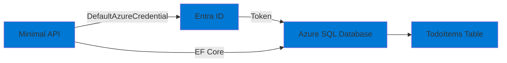

# 03-Db-AzureSql-EFCore

## Purpose

This project demonstrates working with **Azure SQL Database** using **Entity Framework Core** and managed identity authentication. It showcases:

- Minimal API with EF Core
- Database migrations
- Health checks
- CRUD operations via REST API
- Using managed identity for database authentication
- Connection retry policies

## Architecture



## Prerequisites

- .NET 9 SDK
- Azure CLI installed and configured (`az login`)
- Azure subscription with permissions to create resources
- PowerShell 7+ or Bash

## Setup

### 1. Deploy Infrastructure

Deploy the Azure SQL Database:

```powershell
# PowerShell
cd infra
.\deploy.ps1 -ProjectName "03-Db-AzureSql-EFCore" -Environment "dev"
```

```bash
# Bash
cd infra
./deploy.sh 03-Db-AzureSql-EFCore dev
```

This will:
- Create a resource group `rg-ailab-dev`
- Create an Azure SQL Server (Basic tier for cost savings)
- Create an Azure SQL Database (Basic tier, 2 DTU)
- Configure firewall to allow Azure services
- Assign the "SQL DB Contributor" role to your user account
- Output the server name and database name

**Note:** The firewall is configured to allow Azure services. For local development, you may need to add your IP address manually.

### 2. Configure Firewall (Local Development)

Add your IP address to the SQL Server firewall:

```bash
# Get your public IP
MY_IP=$(curl -s ifconfig.me)

# Add firewall rule
az sql server firewall-rule create \
  --resource-group rg-ailab-dev \
  --server sql-ailab-xxxxx \
  --name AllowMyIP \
  --start-ip-address $MY_IP \
  --end-ip-address $MY_IP
```

### 3. Configure Application

Set the SQL Server name:

**Option A: appsettings.json**
```json
{
  "AzureSql": {
    "ServerName": "sql-ailab-xxxxx.database.windows.net",
    "DatabaseName": "demo-db"
  }
}
```

**Option B: Environment Variable**
```powershell
$env:AZURESQL__SERVERNAME = "sql-ailab-xxxxx.database.windows.net"
$env:AZURESQL__DATABASENAME = "demo-db"
```

**Option C: Connection String (Alternative)**
```json
{
  "ConnectionStrings": {
    "DefaultConnection": "Server=sql-ailab-xxxxx.database.windows.net;Database=demo-db;Authentication=Active Directory Default;Encrypt=True"
  }
}
```

### 4. Authenticate Locally

Ensure you're logged in to Azure CLI:

```bash
az login
az account show
```

## Run

### Local Development

```bash
cd src/03-Db-AzureSql-EFCore
dotnet run
```

The application will:
1. Start the Minimal API on `https://localhost:5001` (or `http://localhost:5000`)
2. Apply database migrations automatically
3. Expose REST API endpoints for TodoItems
4. Provide Swagger UI at `/swagger`

### API Endpoints

- `GET /api/todoitems` - Get all todo items
- `GET /api/todoitems/{id}` - Get a todo item by ID
- `POST /api/todoitems` - Create a new todo item
- `PUT /api/todoitems/{id}` - Update a todo item
- `DELETE /api/todoitems/{id}` - Delete a todo item
- `GET /health` - Health check endpoint

### Example Requests

```bash
# Create a todo item
curl -X POST https://localhost:5001/api/todoitems \
  -H "Content-Type: application/json" \
  -d '{"title":"Learn Azure","description":"Study Azure services","isCompleted":false}'

# Get all todo items
curl https://localhost:5001/api/todoitems

# Update a todo item
curl -X PUT https://localhost:5001/api/todoitems/1 \
  -H "Content-Type: application/json" \
  -d '{"id":1,"title":"Learn Azure","description":"Study Azure services","isCompleted":true}'
```

## Smoke Test

```bash
# Run the application
dotnet run

# In another terminal, test the API
curl https://localhost:5001/health
curl https://localhost:5001/api/todoitems

# Expected:
# - Health check returns 200 OK
# - Todo items endpoint returns empty array or existing items
# - Swagger UI accessible at /swagger
```

## Teardown

Remove all resources:

```powershell
# PowerShell
cd infra
.\deploy.ps1 -ProjectName "03-Db-AzureSql-EFCore" -Environment "dev" -Action "destroy"
```

```bash
# Bash
cd infra
./deploy.sh 03-Db-AzureSql-EFCore dev destroy
```

Or manually:

```bash
az group delete --name rg-ailab-dev --yes --no-wait
```

## Troubleshooting

### Authentication Errors

**Error: "Login failed for user"**

- Ensure you're logged in: `az login`
- Verify the SQL Server name is correct
- Check that your account has the "SQL DB Contributor" role
- For local dev, ensure firewall allows your IP

**Error: "Cannot open server" (firewall)**

- Add your IP to the firewall (see Setup step 2)
- Or allow Azure services in the firewall rules

### Connection Errors

**Error: "A network-related or instance-specific error occurred"**

- Verify the server name format: `sql-ailab-xxxxx.database.windows.net`
- Check firewall rules
- Ensure the database exists

### Migration Errors

**Error: "Migration failed"**

- Check database permissions
- Verify connection string
- Ensure the database is accessible

## Cost Considerations

- Azure SQL Database Basic tier: **~$5/month** (2 DTU, 2 GB storage)
- For development, consider using the **Serverless** tier (pauses when inactive)
- Total cost: **~$5-10/month** for basic usage

**Tip:** Use Basic tier for consistent development, or Serverless for cost savings when not actively using.

## Next Steps

- Explore EF Core advanced features (change tracking, raw SQL, etc.)
- Add authentication/authorization to the API
- Implement soft delete patterns
- Add database backup and restore strategies
