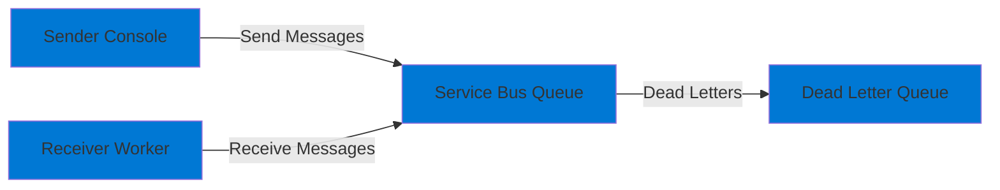

# 04-Messaging-ServiceBus

## Purpose

This project demonstrates **Azure Service Bus** messaging using the Azure SDK and managed identity authentication. It showcases:

- Sending messages to a Service Bus queue
- Receiving and processing messages
- Dead-letter queue handling
- Retry policies
- Batch message sending
- Using RBAC for Service Bus access

## Architecture



## Prerequisites

- .NET 9 SDK
- Azure CLI installed and configured (`az login`)
- Azure subscription with permissions to create resources
- PowerShell 7+ or Bash

## Setup

### 1. Deploy Infrastructure

Deploy the Service Bus namespace and queue:

```powershell
# PowerShell
cd infra
.\deploy.ps1 -ProjectName "04-Messaging-ServiceBus" -Environment "dev"
```

```bash
# Bash
cd infra
./deploy.sh 04-Messaging-ServiceBus dev
```

This will:
- Create a resource group `rg-ailab-dev`
- Create a Service Bus namespace `sb-ailab-<random>` (Basic tier for cost savings)
- Create a queue `demo-queue`
- Assign the "Azure Service Bus Data Owner" role to your user account
- Output the namespace name

### 2. Configure Application

Set the Service Bus namespace:

**Option A: appsettings.json**
```json
{
  "ServiceBus": {
    "Namespace": "sb-ailab-xxxxx",
    "QueueName": "demo-queue"
  }
}
```

**Option B: Environment Variable**
```powershell
$env:SERVICEBUS__NAMESPACE = "sb-ailab-xxxxx"
$env:SERVICEBUS__QUEUENAME = "demo-queue"
```

**Option C: User Secrets**
```bash
dotnet user-secrets set "ServiceBus:Namespace" "sb-ailab-xxxxx"
dotnet user-secrets set "ServiceBus:QueueName" "demo-queue"
```

### 3. Authenticate Locally

Ensure you're logged in to Azure CLI:

```bash
az login
az account show
```

## Run

### Sender Mode

Send messages to the queue:

```bash
cd src/04-Messaging-ServiceBus
dotnet run sender
# or just: dotnet run (sender is default)
```

The sender will:
1. Authenticate using your Azure CLI credentials
2. Send 5 individual messages
3. Send a batch of 3 messages
4. Display confirmation for each message

### Receiver Mode

Receive and process messages:

```bash
cd src/04-Messaging-ServiceBus
dotnet run receiver
```

The receiver will:
1. Start processing messages from the queue
2. Log each message received
3. Process messages (simulated 1-second delay)
4. Dead-letter messages containing "error"
5. Complete successfully processed messages
6. Run until stopped (Ctrl+C)

### Running Both

Open two terminals:

**Terminal 1 (Receiver):**
```bash
cd src/04-Messaging-ServiceBus
dotnet run receiver
```

**Terminal 2 (Sender):**
```bash
cd src/04-Messaging-ServiceBus
dotnet run sender
```

Watch the receiver process the messages sent by the sender.

## Smoke Test

```bash
# Terminal 1: Start receiver
dotnet run receiver

# Terminal 2: Send messages
dotnet run sender

# Expected:
# - Sender sends 8 messages total
# - Receiver processes all messages
# - Messages are completed successfully
# - No errors in logs
```

## Dead Letter Queue

The receiver will automatically dead-letter messages that contain the word "error" in the body. To test:

```bash
# Send a message that will be dead-lettered
# (Modify Program.cs to send a message with "error" in the body)
```

You can view dead-lettered messages in the Azure Portal under the queue's "Dead-letter messages" section.

## Teardown

Remove all resources:

```powershell
# PowerShell
cd infra
.\deploy.ps1 -ProjectName "04-Messaging-ServiceBus" -Environment "dev" -Action "destroy"
```

```bash
# Bash
cd infra
./deploy.sh 04-Messaging-ServiceBus dev destroy
```

Or manually:

```bash
az group delete --name rg-ailab-dev --yes --no-wait
```

## Troubleshooting

### Authentication Errors

**Error: "This request is not authorized to perform this operation"**

- Verify RBAC role assignment:
  ```bash
  az role assignment list \
    --scope /subscriptions/{sub-id}/resourceGroups/rg-ailab-dev/providers/Microsoft.ServiceBus/namespaces/sb-ailab-xxxxx
  ```
- Assign the role manually if needed:
  ```bash
  az role assignment create \
    --role "Azure Service Bus Data Owner" \
    --assignee $(az account show --query user.name -o tsv) \
    --scope /subscriptions/{sub-id}/resourceGroups/rg-ailab-dev/providers/Microsoft.ServiceBus/namespaces/sb-ailab-xxxxx
  ```

### Messages Not Received

- Ensure the receiver is running
- Check that messages were actually sent (check queue metrics in Azure Portal)
- Verify the queue name matches in both sender and receiver configuration
- Check for dead-lettered messages

### Connection Errors

- Verify the namespace name is correct (without `.servicebus.windows.net` suffix in config)
- Check network connectivity
- Ensure firewall rules allow your IP (if enabled)

## Cost Considerations

- Service Bus Basic tier: **~$0.05 per million operations**
- For typical development/testing: **< $1/month** (minimal messages)
- Basic tier has limitations (no topics, no sessions, smaller message size)

**Tip:** Use Basic tier for development. Upgrade to Standard tier for production features (topics, sessions, larger messages).

## Next Steps

- Explore Service Bus Topics and Subscriptions
- Implement message sessions for ordered processing
- Add message scheduling and deferral
- Integrate with Azure Functions (see project 07)
