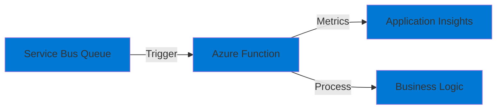

# 07-Serverless-Functions-ServiceBusTrigger

## Purpose

This project demonstrates **Azure Functions** with Service Bus triggers. It showcases:

- Isolated worker process model
- Service Bus queue trigger
- Custom metrics to Application Insights
- Error handling and dead-lettering

## Architecture

## Implementation TODO

1. **Service Bus Function**
   - Implement ServiceBusTrigger function
   - Process messages
   - Emit custom metrics
   - Handle errors

2. **Configuration**
   - Configure ServiceBusConnection
   - Set up Application Insights
   - Configure host.json settings

3. **Bicep Infrastructure**
   - Create Function App (Consumption plan)
   - Configure Service Bus connection
   - Set up Application Insights

## Prerequisites

- .NET 9 SDK
- Azure Functions Core Tools
- Azure CLI

## Cost Considerations

- Functions Consumption: **First 1M requests/month free**, then pay per execution
- For development: **Typically free or < $1/month**

## Next Steps

- Implement the function
- Add Application Insights integration
- Test locally with Azure Functions Core Tools
- Deploy to Azure
