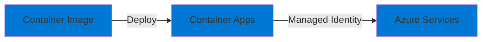

# 08-Hosting-ContainerApps-MinimalApi

## Purpose

This project demonstrates hosting a **Minimal API** in **Azure Container Apps**. It showcases:

- Containerizing .NET applications
- Deploying to Container Apps
- Using managed identity
- Health checks

## Architecture

## Implementation TODO

1. **Minimal API**
   - Add more endpoints
   - Implement business logic
   - Use managed identity for Azure services

2. **Dockerfile**
   - Optimize for production
   - Multi-stage build (already done)

3. **Bicep Infrastructure**
   - Create Container Apps Environment
   - Create Container App
   - Configure managed identity
   - Set up ingress

## Prerequisites

- .NET 9 SDK
- Docker
- Azure CLI

## Cost Considerations

- Container Apps: **Pay per vCPU and memory used**
- Consumption plan: **~$0.000012/vCPU-second, ~$0.0000015/GB-second**
- For development: **< $5/month** (minimal usage)

## Next Steps

- Complete Minimal API implementation
- Build and push container image
- Deploy to Container Apps
- Configure managed identity
