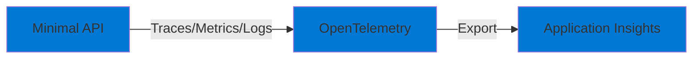

# 09-Observability-AppInsights-Otel

## Purpose

This project demonstrates **OpenTelemetry** integration with **Application Insights**. It showcases:

- Distributed tracing
- Custom metrics
- Structured logging
- Correlation IDs
- Dependency tracking

## Architecture

## Implementation TODO

1. **OpenTelemetry Configuration**
   - Add Azure.Monitor.OpenTelemetry.AspNetCore
   - Configure tracing, metrics, logging
   - Set up Application Insights connection string

2. **Instrumentation**
   - Add custom spans
   - Emit custom metrics
   - Use structured logging with correlation IDs

3. **Bicep Infrastructure**
   - Create Application Insights workspace
   - Configure connection string

## Prerequisites

- .NET 9 SDK
- Azure CLI

## Cost Considerations

- Application Insights: **First 5 GB data ingestion/month free**, then pay per GB
- For development: **Typically free or < $5/month**

## Next Steps

- Configure OpenTelemetry
- Add instrumentation
- Test with Application Insights
- View traces and metrics in Azure Portal
