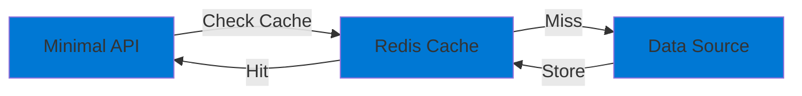

# 11-Caching-Redis

## Purpose

This project demonstrates **Azure Cache for Redis** with the cache-aside pattern. It showcases:

- Redis connection and configuration
- Cache-aside pattern implementation
- Cache hit/miss handling
- TTL and expiration

## Architecture

## Implementation TODO

1. **Redis Configuration**
   - Configure connection string
   - Set up IDistributedCache

2. **Cache-Aside Pattern**
   - Check cache first
   - Load from data source on miss
   - Store in cache
   - Set TTL

3. **Bicep Infrastructure**
   - Create Redis Cache (Basic tier)
   - Configure firewall
   - Set up RBAC

## Prerequisites

- .NET 9 SDK
- Azure CLI

## Cost Considerations

- Redis Basic C0: **~$15/month** (250 MB cache)
- For development: **Consider using local Redis** or free tier if available

## Next Steps

- Configure Redis connection
- Implement cache-aside pattern
- Add cache management endpoints
- Test cache performance
