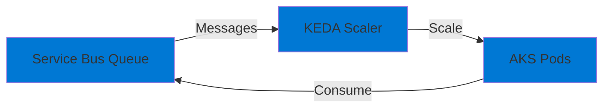

# 12-Advanced-AKS-Keda-ServiceBus

## Purpose

This project demonstrates **Kubernetes Event-Driven Autoscaling (KEDA)** with **Azure Kubernetes Service (AKS)**. It showcases:

- Worker service consuming Service Bus
- KEDA autoscaling based on queue depth
- AKS deployment
- Horizontal Pod Autoscaler (HPA) integration

## Architecture



## ⚠️ Cost Warning

**This project is significantly more expensive than others:**
- AKS cluster: **~$75-150/month** (minimum)
- Node pool costs
- Load balancer costs
- **Total: ~$100-200/month minimum**

**Only deploy this if you need to learn AKS/KEDA specifically.**

## Implementation TODO

1. **Worker Service**
   - Implement Service Bus consumer
   - Configure for Kubernetes deployment

2. **Kubernetes Manifests**
   - Deployment manifest
   - KEDA ScaledObject for Service Bus
   - Service and ingress

3. **Bicep/Infrastructure**
   - Create AKS cluster (or use existing)
   - Install KEDA
   - Deploy application

## Prerequisites

- .NET 9 SDK
- Docker
- kubectl
- Azure CLI
- AKS cluster (or create one)

## Teardown

**IMPORTANT: Always teardown AKS resources to avoid high costs!**

```bash
# Delete AKS cluster
az aks delete --name <cluster-name> --resource-group <rg> --yes
```

## Next Steps

- Implement worker service
- Create Kubernetes manifests
- Install KEDA in cluster
- Deploy and test scaling
